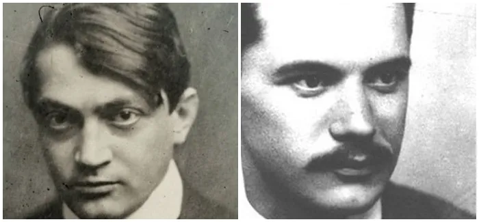

## Have you every wanted to write poetry like your favorite poet? How about two of your favorite poets?
### Say no more, Markov models are here to help you!

You can create a Markov model of all the poems of your selected poets, and then generate poems yourself!

I've created a Markov model using the poems of **Ady Endre and József Attila**. It's like Ady Endre and József Attila had a secret love child!

  

Sample generated poems:

> egy ki eget mér és bólint  kín löki játsszék odakint  egy nagyon tiszta vízcseppet  vigyázz beloled is lehet

> rászáll nehány szép éjbogár
nem volt erkölcsi példatár
mit mondjak most hogy ég veled
törje kapa a tenyered

> zászlókkal zenékkel megyek
viszontlátome ot egek
s kérlelték vének és papok
nem szeretnek a gazdagok

> köröskörül vastorökül
melybe háziur települ
egyszer ha nem vigyázna rám
s eldobtad ahogy az apám

Enjoy!

**Some ways to improve the project:**
- Use spell correction
- Implement additional rhyme formulas
- Use bigger corpus from additional sources
